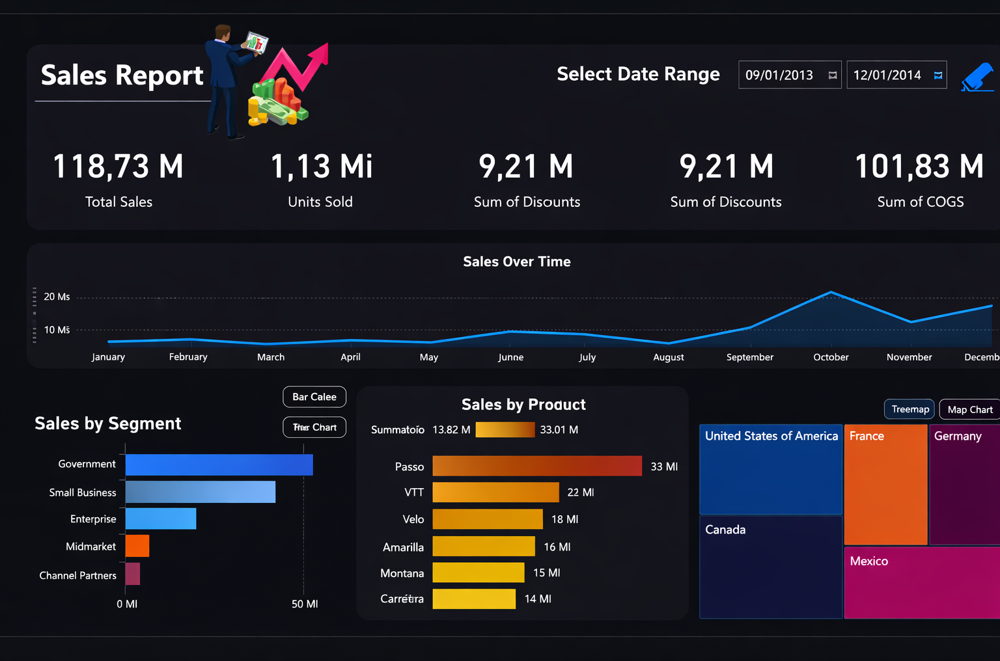
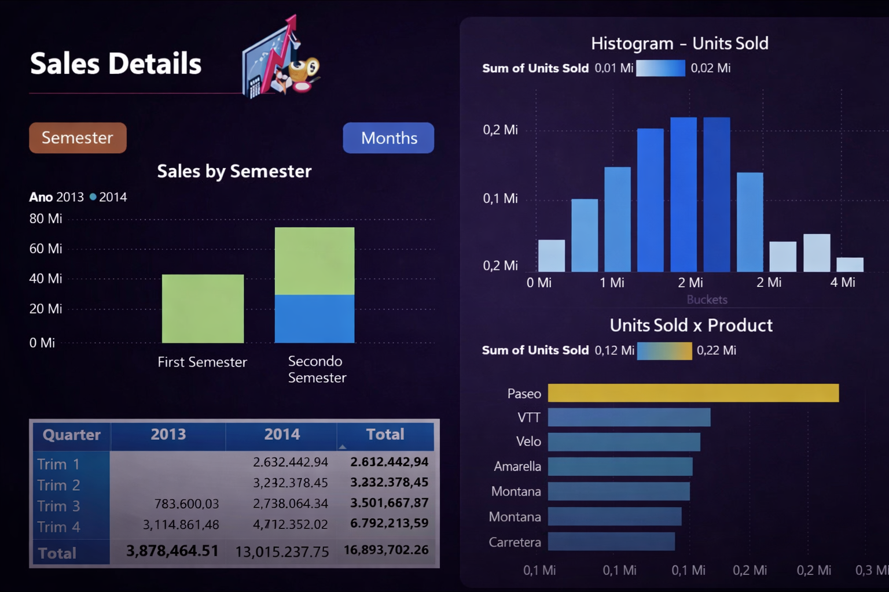

# Creating a Sales and Profit Report with Data Analytics using Power BI

Project developed at the Bootcamp Power BI Analyst Training, under the guidance of specialist [Juliana Zanelatto](https://github.com/julianazanelatto/ "Juliana Zanelatto").

Project Challenge - Updating a Financial Report Focusing on User Experience

## Challenge Objective

- Modify the creative report, focusing on user experience, taking into account the following points:
- Positioning
- Contrast
- Golden Ratio
- Data Segmentation

This isn't a rigid rule. Understand the points and create your report taking them into consideration. However, know when you should break the rules. This will bring more creativity to your report. These outliers make your report more interesting.

## Next Steps

- Insert navigation buttons
- Modify the second page similarly to the challenge shown for the first page
- Modify the navigation buttons to highlight focus and select
- Create navigation menus on each page
- The button style is free!
- The report consists of 3 pages

Page one

Page two

Page three

[LICENSE](/LICENSE)

See [original repository](https://github.com/julianazanelatto/power_bi_analyst).
